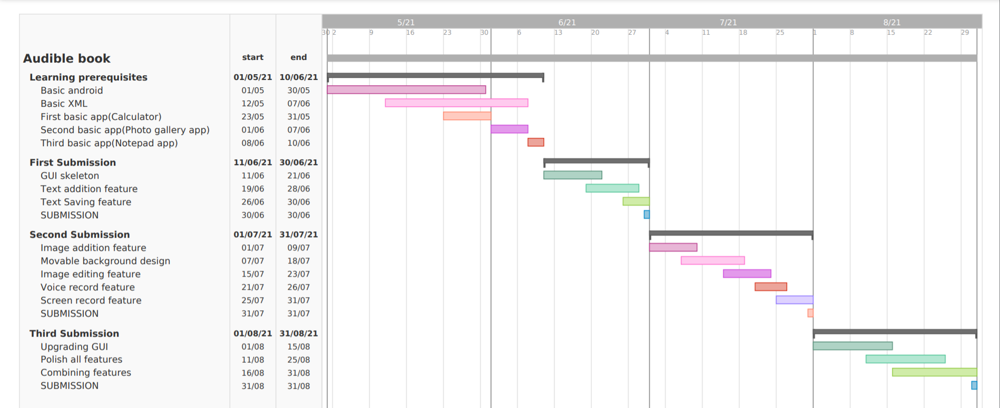

# G52-Audible-Textbook

Key Features
-------------

We are trying to develop an app to help kids to enjoy their textbooks. The can also practice their creativity by writing poems, short stories in our app.

Feature 1: Parents may create new accounts for their children

Feature 2: Can make a movie from their textbook by screen recording

Feature 3: Can add images as background of the movie

Feature 4: Can add new characters from character's library

Feature 5: Can make animation by moving characters on the screen and record their voice as well

Feature 6: Can save it in internal storage

Report on learning prerequisites
---------------------------------

SL  |   Topic  | Status |
:-: | :-------:| :-----:|
1   | Basic Android|  |
2   | Basic XML    |  |
3   | First Basic App|  |
4   | Second Basic App|  |
5   | Third Basic App|  |

Acknowledgments
---------------

All praises to Allah for the strengths and His blessing in completing this project.

The final outcome of this project required a lot of guidance and assistance from many people, and we are extremely thankful to have got this throughout the duration of our project work.

First, we would like to express our gratitude to our course teacher Enamul Hassan, who has allowed us to take on this project, for his continuous support and guidance. 

We would also like to thank the following individuals, without whom the completion of this project would not have been possible. 

•	Tanhab Hossain, CSE 2018-19, SUST, for his help and guidance in implementing Firebase.

•	Sadekujjaman Saju, CSE 2017-18, SUST, for his warm support and guidance.

•	Mahinur Alam, CSE 2018-19, SUST, for helping us with adding the recording feature.

•	Susmoy Dhar, CSE 2018-19, SUST, for helping us with some hardware problems.

•	Mahdi Murshed, CSE 2018-19, SUST, for his assistance and advice.

•	Moksedur Rahman Sohan, CSE 2018-19, SUST, for being the tech geek.

Also, we want to thank the internet community from which we have received countless help and advice in dealing with various issues that had risen while working on this project.

Some icons and images used in the project: [img1](https://lovepik.com/images/png-boys.html), [img2](https://lovepik.com/images/png-baby.html), [img3](https://lovepik.com/images/png-cat.html), [img4](https://lovepik.com/images/png-baby.html), [img5](https://lovepik.com/images/png-beauty.html), [img6](https://www.vectorstock.com/royalty-free-vector/upload-image-white-flat-icon-on-color-background-vector-19441191.html), [img7](https://lovepik.com/images/png-dog.html)

We also thank the creator of [this](https://github.com/HBiSoft/HBRecorder ) library that was used.

Developers
----------

Group number: 52

Group name: Tehetetlen

Group members:

Samia Preity

Registration number: 2018331008

Email: samiapreity23dnt@gmail.com

Phone number: 01770056982

Fatima Nuzhat

Registration number: 2018331106

Email: fatima06@student.sust.edu

Phone number: 01401647383

<small>&copy; 2021 - Dept. of CSE, SUST, BD</small>
