Hello User!
------------
Here is the description of our project, and implemented features. Hope you will find it helpful.

1. The first page of our project is the register page. If you do not have an account in Funbook, you have to register. For this, you need an Email account, and a password! You have to fill up the required fields with caution, cause if you leave the email empty/ use a password less than 6 digit/ do not confirm the right password, it will show an error message. an error message is shown in the photo: 

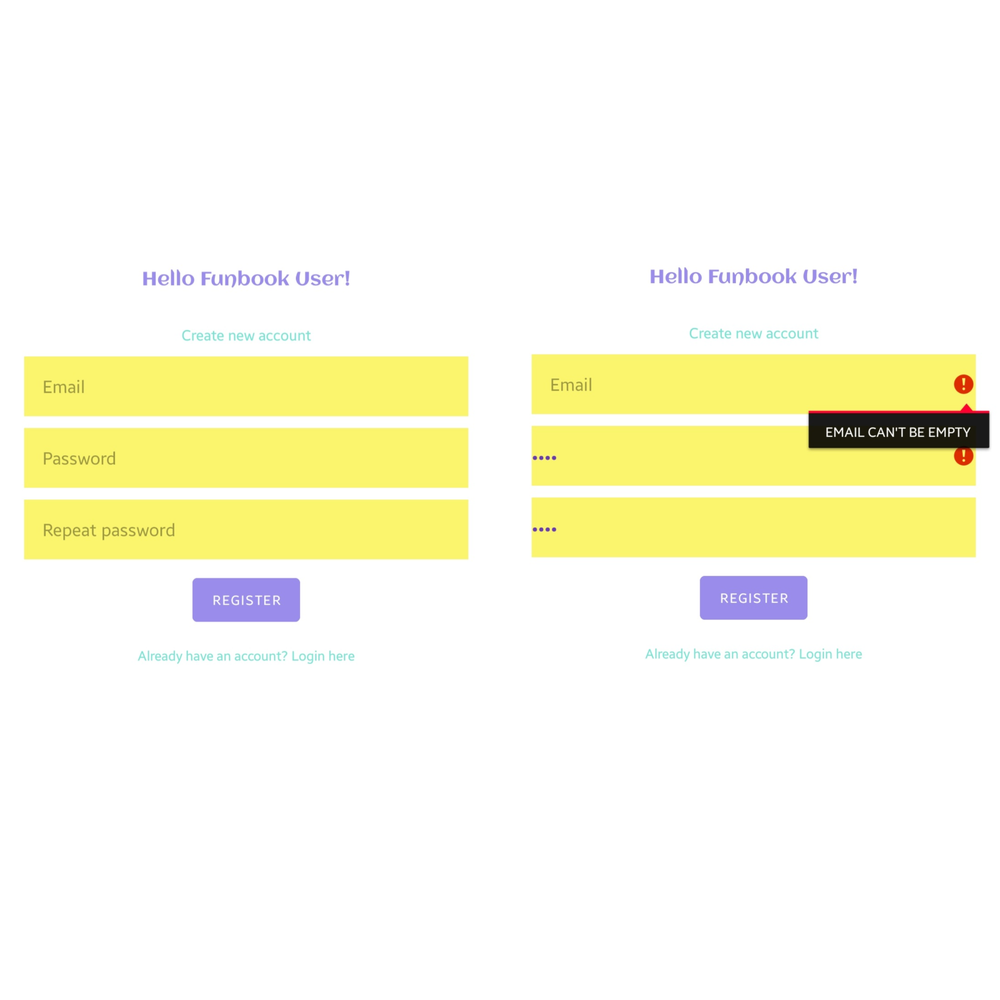

2. If you fill up the fields correctly, and you have internet connection, you will be sent to login page. Also you will see a message "Mail sent". Yes, you have to verify your email account before logging in. Here is the example of how it will look like if you try logging in without verifying your mail.

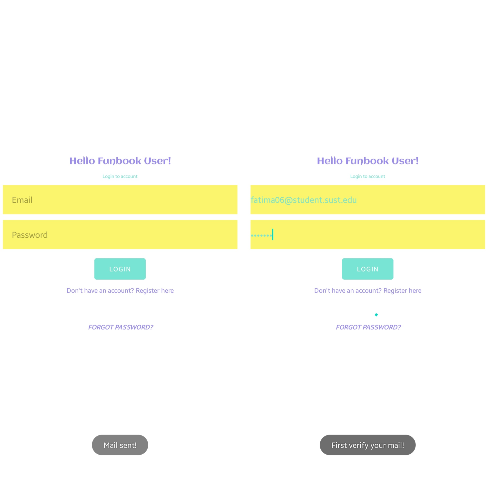

3. Forgot password? No problem, use our forgot password method.
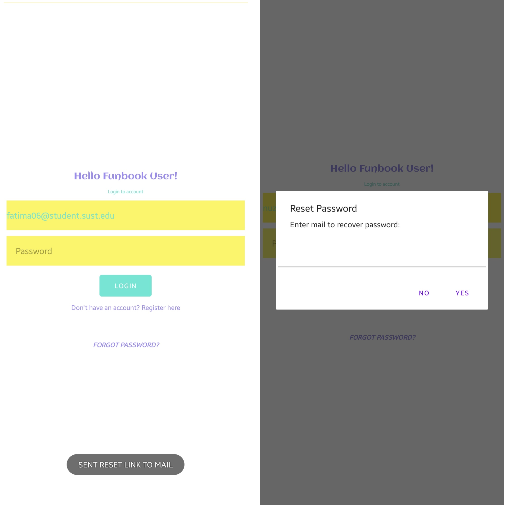

4. Now you're in the landing page. Wanna make a movie for your little one? Select the add background button to choose images from your gallery to be the background of your next video!

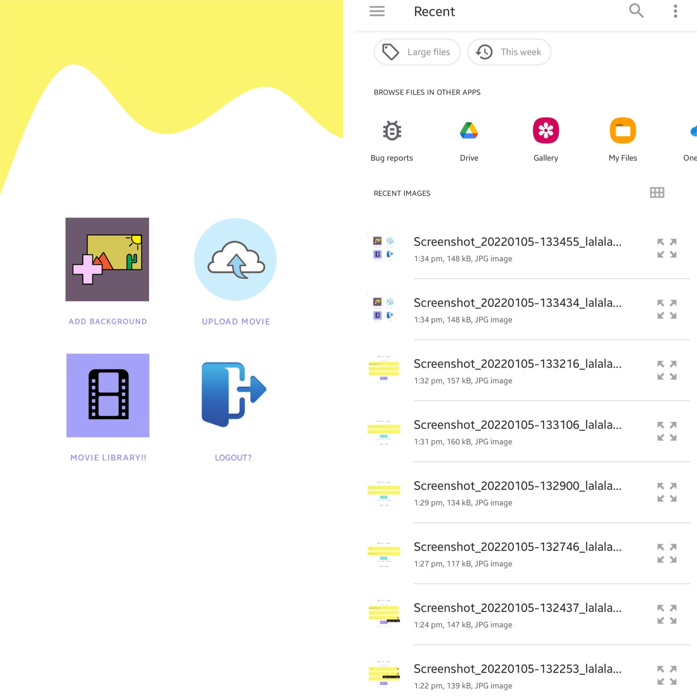

5. Now you are in the movie page. click butons to add charecters dynamically. If you're done with adding charecters, click done.

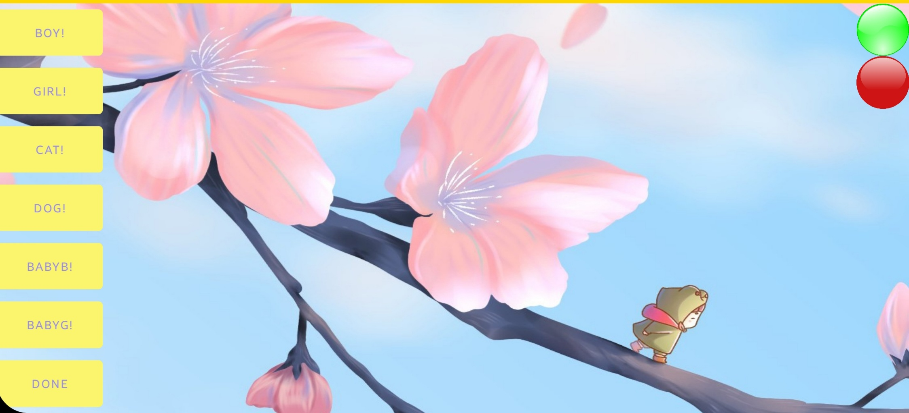
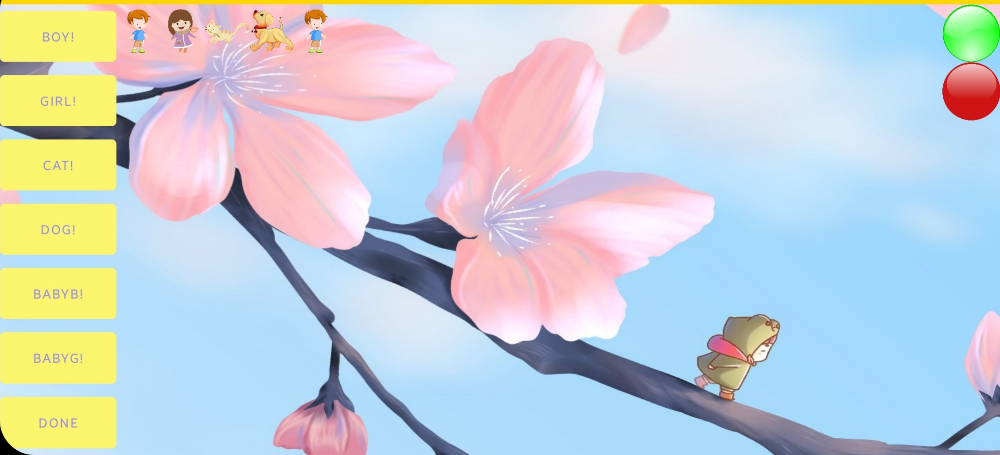

6. Now start the fun! move and resize the charecters, click green button to start recording, accept the permission to let it record, and the red button to finish recording. Yep, now the video is in your local storage! Check out your Movies folder.

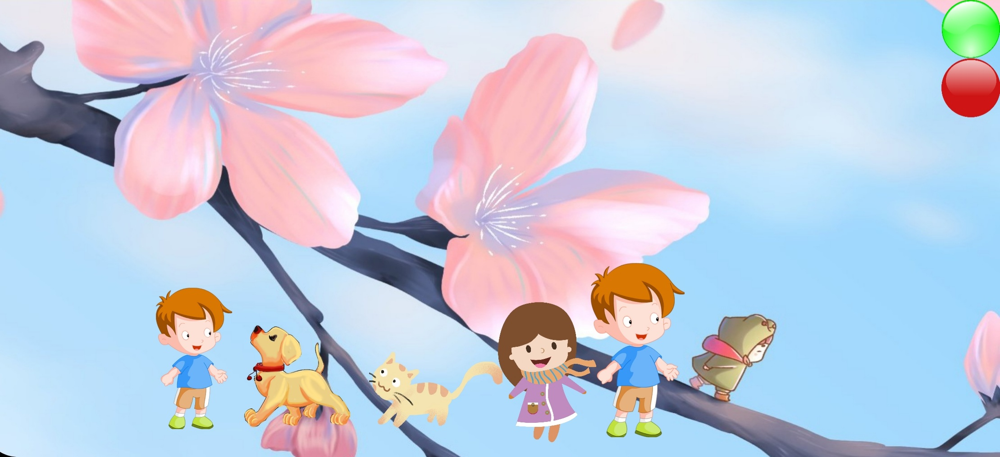
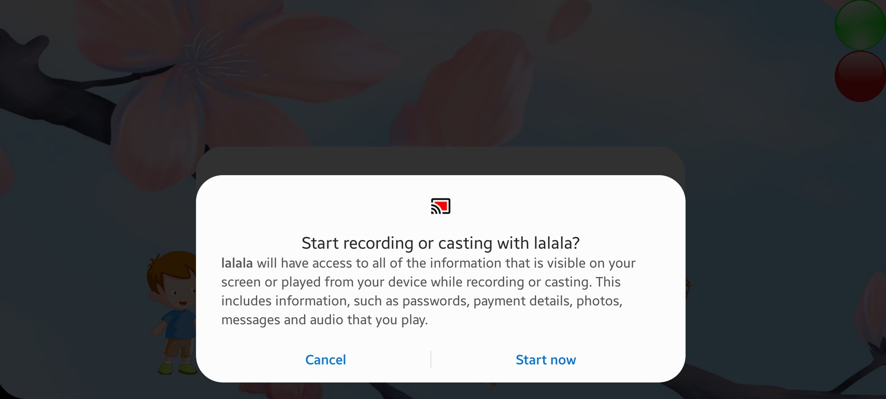

7. Now if you want to upload your movie to cloud storage, name a caption, and hit Upload! Now it's uploading.

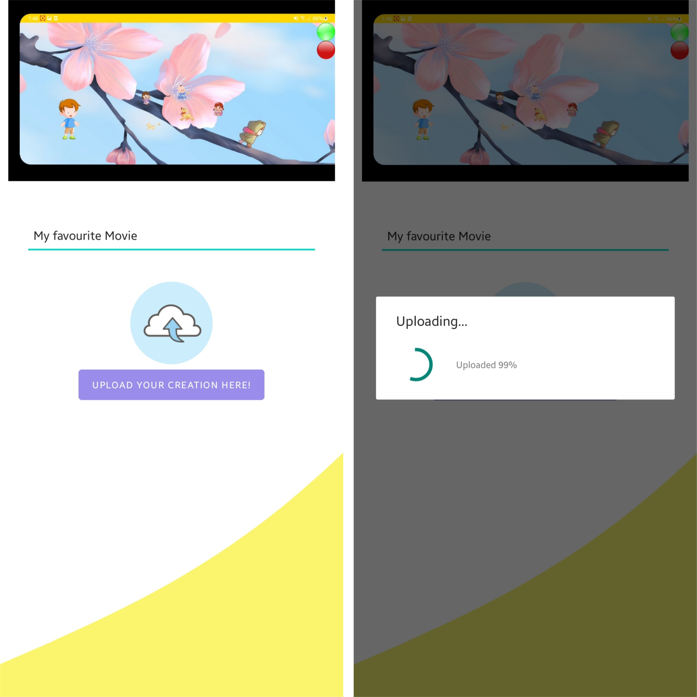

8. Forgot to upload your video earlier? No problem. Go to the homepage and hit Upload Movie to upload your previously created work.

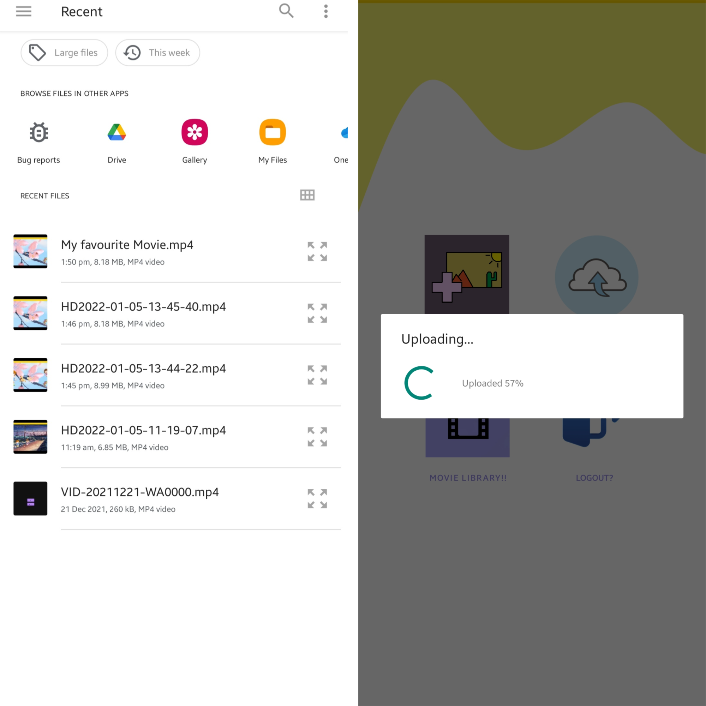

9. Wanna see your movies from cloud storage? Hit the Movie Library button.Can you see that the cute little videos have beautiful controllers? Wanna download one? Click and hold the green button to download.

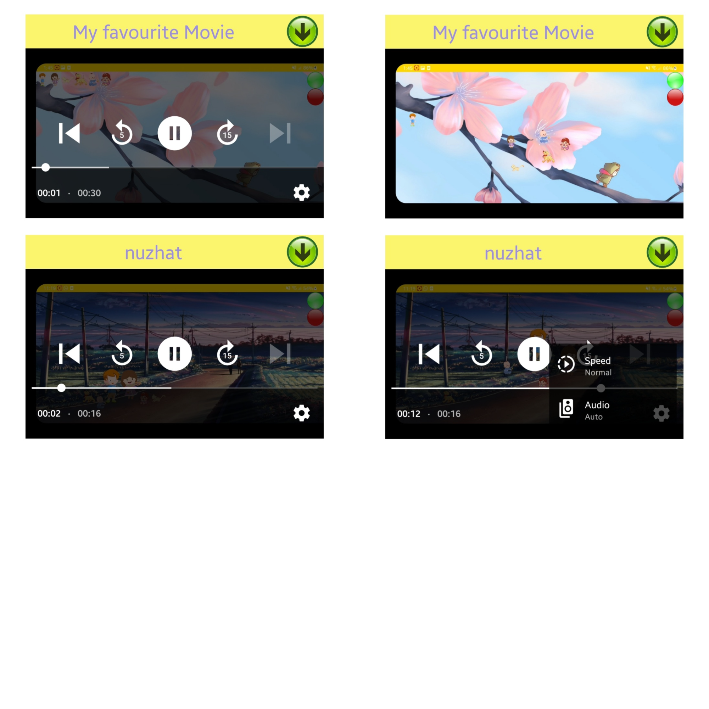
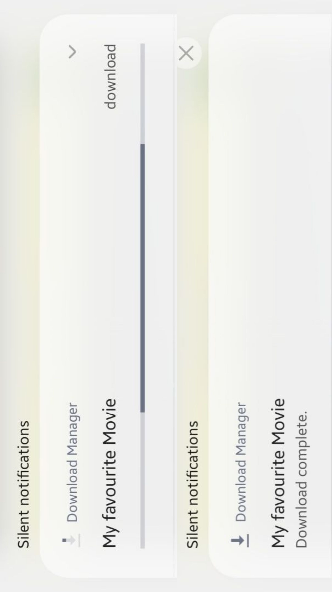

10. Had fun? Wanna log out now? Okay press the logout button. But we wanna see you again soon!

Unfortunately there is one unimplemented feature. You can't delete a video from cloud storage. Despite this, we implemented all other features.

Thank you!
