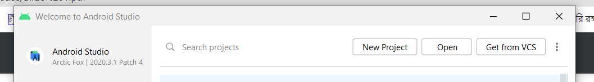
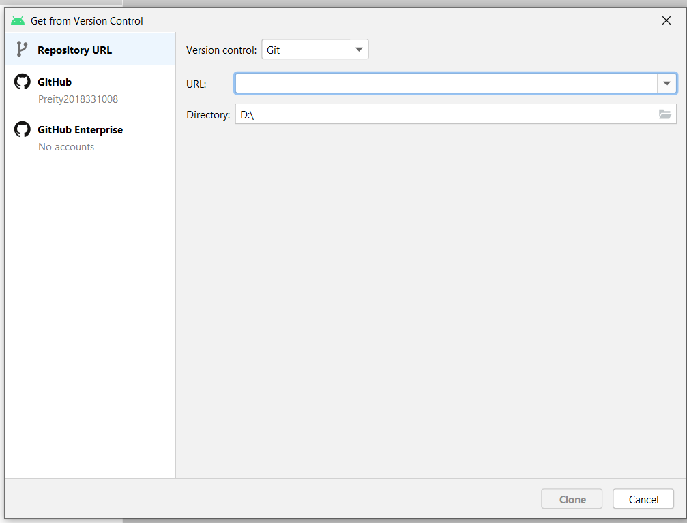

Hello new user!
---------------
Here are some instructions to set up my project on your computer. Hope you will find my instructions helpful.

1. Go [there](https://developer.android.com/studio) and install the latest version of android studio.
2. Make sure you have JDK installed
3. If you already have android studio, make sure your version is >= Android Studio Arctic Fox | 2020.3.1 Patch 4
4. Complete the installation, it may take time.
5. Click on "get from VCS"

6. Copy the url of this repository and select the Directory to set up this project! Press Clone.

7. Wait for a while when the dependencies are downloading.
8. Press on Sync project.
9. BOOM! Hope you have built the project!

Additional instructions:
-------------------------
1.	This project uses Firebase database for storing data. If you want the access on the current available data, you must contact me, I will make you the new owner of the database.
Else, you can sign out from Firebase, and add your new firebase project with the funbook project.
2.	Technology is changing every day. If you are facing problems with deprecated methods/classes, do know, that is not a problem. Deprecated method means now there is a better way/method to do the same without affecting performance. So, it’s time to google! Replace the deprecated/removed methods with new ones.
3.	If you’re getting any error message like “Failed to find build tools revision 30.0… “or any such sdk related problem, go to settings->Appearance and Behavior ->Android SDK and download components that are missing.
4.	Do not forget, for any query, you have our contact information below. And Google-and-learn is the best technique!
